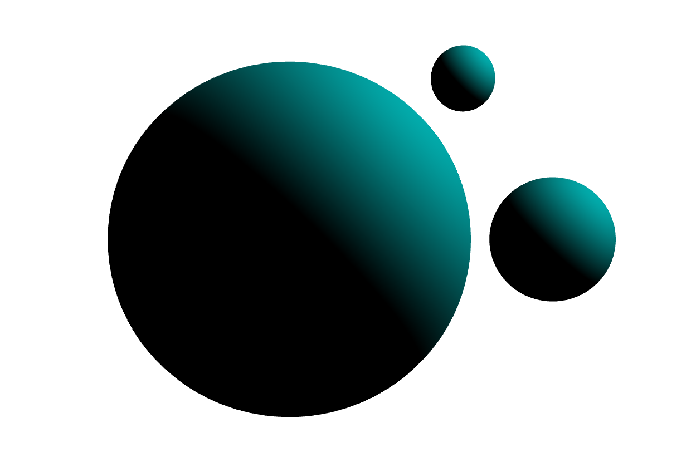

# Shadow mapping implementation in WebGL2
#### Daniele S. Cardullo - 2127806

## The need for shadows
A basic scene with three spheres can be simply rendered using a vertex shader, a fragment shader and simply writing basic WebGL, the obtained result is something like:

From this view we are not able to understand if we are depicting spheres or just plain circles, nonetheless we don't have any information about their relative positions or position with respect to light. The latter can be resolved by adding shading effects, obtaining:

But still we don't have any information about the relative position of the spheres with respect to each other and with the light, we just have an information about how the light ray is directioned with respect to the surface normals. To obtain such information we need to add shadows which enhance the visualization and realism of the scene, by giving us hints to understand how the spheres (in this case) are positioned in the space:

