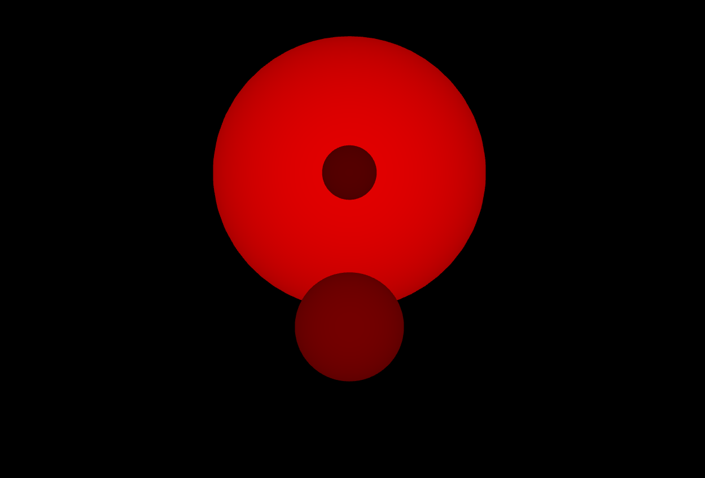

# Shadow mapping implementation in WebGL2
#### Daniele S. Cardullo - 2127806

## The need for shadows
A basic scene with three spheres can be simply rendered using a vertex shader, a fragment shader and simply writing basic WebGL, the obtained result is something like:

From this view we are not able to understand if we are depicting spheres or just plain circles, nonetheless we don't have any information about their relative positions or position with respect to light. The latter can be resolved by adding shading effects, obtaining:

But still we don't have any information about the relative position of the spheres with respect to each other and with the light, we just have an information about how the light ray is directioned with respect to the surface normals. To obtain such information we need to add shadows which enhance the visualization and realism of the scene, by giving us hints to understand how the spheres (in this case) are positioned in the space:

## How to implement shadows
In order to implement the renderization of shadows it is necessary to use a technique called "Shadow Mapping", i.e. we need to create a 2D texture which contains the depth map of the scene as seen from the light source, then we compare each fragment depth with the depthmap created providing illumination only to what is in front, and shadowing what is in the back.

To create the depth map it is required to create an additional pair of shaders, which will compute the position of each vertex from the light point of view and then instead of outputting a color to the frame buffer, the fragment shader will output the depth of the fragment as seen from the light. It is possible to also show this light view depth map:

In order to have the position of the vertices from the light point of view it is necessary to create a matrix, which is the result of the multiplication of the light projection matrix (an orthographic projection) and the light view matrix (a look at matrix, from the light position to the center of the scene).

After creating the shadow map (the texture obtained from the depth map), we can sample it in the main fragment shader, making comparison between the depth of the fragment and the depth in the shadowmap, this will return $1$ if the fragment is in the light, or $0$ if it is in the shadows. 

In order to avoid some effects light shadow acne it is necessary to bias the depth computation, and also to enhance the smoothing it is also possible to use adjacent points.